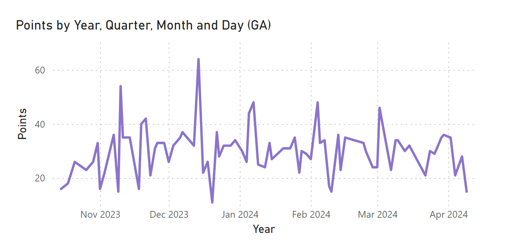

# nba-analytics
Project for Cloud Computing (CSC4311) that uses containerized Python scripts on Azure to create and fill SQL tables with data to create Power BI visuals. 


## RapidAPI Access 
1. **Obtain API Key & Host**
- Go to https://rapidapi.com/api-sports/api/api-nba/details to view details about this specific API.
- Head over to "Pricing" tab. Here you can subscribe to the 'Basic' tier and have limited free access to the API. This will allot you to a max of 100 calls per day. Our scripts don't come close to the daily limit.
- Save API key & host URl. If lost, they can be viewed on the 'endpoints' tab on RapidAPI.


## Setting up Cloud Environment & Scripts
1. **Create a Resource Group**
- Search 'Resource Group' in Azure search bar.
- Fill in 'Resource Group' name, 'Subscription' & 'Region'.


2. **Create Linux Virtual Machine**
- Search 'Free Services' in Azure search bar.
- Create 'Linux Virtual Machine'.
- Fill out form with cheapest VM, making sure to add the recently created Resource Group as its 'Resource Group'.

  
3. **Create SQL Server & Database**
- Search 'Free Services' in Azure search bar.
- Create 'Azure SQL Database'.
- Fill out form, ensuring your adding the resource to your 'Resource Group'.
  - If possible, take advantage of 'free serverless database' offer.
- Select 'Basic' for 'Service Tier' and 'Serverless' for 'Computer Tier'.
- Select 'Data Max Size' as either 1 or 2.
- Set 'Workload Environment' to 'Development'.
- For the Networking tab, select 'Add current client IP address' and 'Allow Azure services and resources to access this server'.
- For the Security tab, disable Microsoft Defender for SQL. Leave other tabs settings to default and Create.

4. **Connecting to Linux Virtual Machine**
- From your Resource Group, go to VM and hit 'Connect'.
- Select 'Connect with SSH using Azure CLI'. Start the VM if it is not already on.
- Run a few commands to set up VM such as
```
sudo apt update
 ```
- Azure CLI

```
sudo apt install azure-cli
 ```
- Python

```
sudo apt install python3
 ```
- For Docker, follow instructions on official website: https://docs.docker.com/engine/install/ubuntu/
- With that, you will be able to now create scripts and turn them into images.

5. **Adding scripts**
- First, create three directories: nba_teamdata, nba_playerdata, nba_staticdata
- To transfer files, simply copy contents of source code and paste into code editor of file. Save to preserve changes.
- nba_teamdata will have scripts found in 'team scripts'
- nba_playerdata will have scripts found in 'player scripts' and 'static 'scripts'
- nba_staticdata will have scripts found in 'static scripts'.
- Each directory will have a Dockerfile. Remember to set all sensitive information (api key, host url, server credentials etc) in the Dockerfile. The players Dockerfile looks like
```
# Use official Python runtime as a parent image
FROM python:3.8-slim

# Set environment variables
ENV HOST="your api host url" \
    KEY="your api key" \
    SERVER_NAME="your server name" \
    DATABASE_NAME="your database name" \
    USERNAME="server username" \
    PASSWORD="server password"

# Install required system dependencies
RUN apt-get update && apt-get install -y --no-install-recommends \
    gnupg \
    curl \
    apt-transport-https \
    && curl https://packages.microsoft.com/keys/microsoft.asc | gpg --dearmor -o /etc/apt/trusted.gpg.d/microsoft.gpg \
    && curl https://packages.microsoft.com/config/debian/11/prod.list > /etc/apt/sources.list.d/mssql-release.list \
    && apt-get update \
    && ACCEPT_EULA=Y apt-get install -y msodbcsql18 \
    && apt-get clean \
    && rm -rf /var/lib/apt/lists/*

# Install system dependencies
RUN apt-get update \
    && apt-get install -y unixodbc-dev gcc g++ \
    && rm -rf /var/lib/apt/lists/*

# Set the working directory in the container
WORKDIR /app

# Copy the current directory contents into the container at /app
COPY . /app

# Install Python dependencies
RUN pip install --no-cache-dir -r requirements.txt

# Run the Python scripts individually
CMD ["python", "nba_api_gamestats2023.py"]
CMD ["python", "nba_api_playerstatskd.py"]
CMD ["python", "nba_api_playerstatsga.py"]
CMD ["python", "nba_api_playerstatslj.py"]
CMD ["python", "nba_api_playerstatssc.py"]

```
- The teams Dockerfile looks like

```
# Use official Python runtime as a parent image
FROM python:3.8-slim

# Set environment variables
ENV HOST="your api host url" \
    KEY="your api key" \
    SERVER_NAME="your server name" \
    DATABASE_NAME="your database name" \
    USERNAME="server username" \
    PASSWORD="server password"

# Install required system dependencies
RUN apt-get update && apt-get install -y --no-install-recommends \
    gnupg \
    curl \
    apt-transport-https \
    && curl https://packages.microsoft.com/keys/microsoft.asc | gpg --dearmor -o /etc/apt/trusted.gpg.d/microsoft.gpg \
    && curl https://packages.microsoft.com/config/debian/11/prod.list > /etc/apt/sources.list.d/mssql-release.list \
    && apt-get update \
    && ACCEPT_EULA=Y apt-get install -y msodbcsql18 \
    && apt-get clean \
    && rm -rf /var/lib/apt/lists/*

# Install system dependencies
RUN apt-get update \
    && apt-get install -y unixodbc-dev gcc g++ \
    && rm -rf /var/lib/apt/lists/*

# Set the working directory in the container
WORKDIR /app

# Copy the current directory contents into the container at /app
COPY . /app

# Install Python dependencies
RUN pip install --no-cache-dir -r requirements.txt

# Run the Python script
CMD ["python", "nba_api_teamstats.py"]

```

- The static Dockerfile looks like
```
# Use official Python runtime as a parent image
FROM python:3.8-slim

# Set environment variables
ENV HOST="your api host url" \
    KEY="your api key" \
    SERVER_NAME="your server name" \
    DATABASE_NAME="your database name" \
    USERNAME="server username" \
    PASSWORD="server password"

# Install required system dependencies
RUN apt-get update && apt-get install -y --no-install-recommends \
    gnupg \
    curl \
    apt-transport-https \
    && curl https://packages.microsoft.com/keys/microsoft.asc | gpg --dearmor -o /etc/apt/trusted.gpg.d/microsoft.gpg \
    && curl https://packages.microsoft.com/config/debian/11/prod.list > /etc/apt/sources.list.d/mssql-release.list \
    && apt-get update \
    && ACCEPT_EULA=Y apt-get install -y msodbcsql18 \
    && apt-get clean \
    && rm -rf /var/lib/apt/lists/*

# Install system dependencies
RUN apt-get update \
    && apt-get install -y unixodbc-dev gcc g++ \
    && rm -rf /var/lib/apt/lists/*

# Set the working directory in the container
WORKDIR /app

# Copy the current directory contents into the container at /app
COPY . /app

# Install Python dependencies
RUN pip install --no-cache-dir -r requirements.txt

# Run the Python script
CMD ["python", "nba_apiteamtest.py"]

```

- requirements.txt has the following text
```
requests==2.26.0
pyodbc==4.0.32
python-dotenv==0.19.1
```

## Automate Scripts
1. Make Container Registry (CR)
- Return to Azure website and search 'Container Registry'
- Select 'Create' and fill out form (for the example we called it 'nbadockerikmages'). Like always assign to your Resource Group.
- Select the most basic plan and Create.
- Save credentials (registry name + password key(s))
2. Build Docker Images
- Use following command to build nba-playerstats image
```
sudo docker build -t [registeryname].azurecr.io/nba-playerstats:latest .
```

- Use following command to build nba-teamstats image
```
sudo docker build -t [registeryname].azurecr.io/nba-teamstats:latest .
```
- Use following command to build nba-staticstats image
```
sudo docker build -t [registeryname].azurecr.io/nba-staticstats:latest .
```
3. Login to Container Register on CLI
- Enter the following command. You will be prompted to enter your registry's name and a valid password (check your access keys in your registry's settings)
```
sudo docker login [registeryname].azurecr.io
```
4. Push image to CR
- Now enter the following command to push image to container registry. Now your image should appear on your CR on the website. Repeat for player and team images.
```
sudo docker push [registryname].azurecr.io/nba-playerstats:latest
```

5. Create Container Instance with Container Registry Image
- Enter the following command. A CI will now appear on the Azure website.
- Repeat for both player and team images.
```
az container create --resource-group <resource_group_name> --name <container_instance_name> \
    --image [registryname].azurecr.io/[containerregistryimagename] \
    --registry-login-server [registryname].azurecr.io \
    --registry-username <registry_username> \
    --registry-password <registry_password> \
    --dns-name-label <container_instance_name> \
    --ports 80 \
```
6. Create Logic App
- Return to Azure website and search 'Logic Apps' in search bar
- Select 'Add' on Logic Apps page.
- Fill out form, putting the same Resource Group as other resources have.
- Set 'Publish' to 'Workflow'. Disable Zone Redundancy. 
- Set plan type to 'Consumption'.
- For Storage, create a storage account if one isn't made already.
- Enable public access on 'Networking' tab.
- Create Logic App when all necessary fields are filled.

7. Automate with Logic App
- Go to Logic App and view 'Logic App Designer' under 'Development Tools'
- Click on the (+) sign to add a Trigger. This is what will cause the scripts to run.
- Set Trigger to be "Recurrence", "Interval" set to "1", "Frequency" set to "Day", set "Timezone" to "Eastern Time" and "At These Hours" to "2". Save
- Add Action to "Azure Container Instance", specifically "Start containers in container group".
- Provide subscription id, the resource group the CI is in and its name. Save and repeat for both instances.

8. Allow Logic App to trigger so data can be requested and inserted into DB.

## Import Data into Power BI

1. Download [Power BI](https://powerbi.microsoft.com/en-us/desktop/) if not already installed (Only available for Windows).
2. Launch Power BI.
3. Open new Report. When prompted to 'Add data to your report' select 'Import data from SQL server'
4. Enter the server name and database name respectively (found on Azure).
5. Enter login credentials for the Azure SQL server (username + password). Verify that 'data connectivity mode' is set to 'Import'.
6. If set up correctly, a pop up window will appear with all the tables you have currently stored on the database. Check off the tables you are interested in seeing statistics for.
7. Load data into Power BI report.

## Make Visuals with Power BI
1. Report starts off with no visuals until you decide on what data you want to include and how you want to display it.
2. Click on "Data" sidebar on the right, this is where the tables' fields can be found. Each table has many fields which can be viewed.
3. For example, with a player table, try checking off "Points" and "GameDate". Set GameDate to X-axis and Points to the Y-Axis. Finally 'build visual' as a 'Line chart'.



5. Analyze visual or add to it with more stats from same or different player. Or even try visualizing the data with a different visual. What can you conclude from this?
- Now you are able to automate scripts that request data from an API and subsequently insert it into an Azure SQL Database. With that data you are able to make visuals in Power BI.

## Notes
- It should be noted that the script fetches data for the 2023-2024 regular season and since that has recently concluded, it will no longer update (unless the season is changed!).
- If having issues with trying to access own server through Power BI, feel free to reach out to Raymond (raymondhr12@gmail.com) or Ashwin (ashwinkarpagam@gmail.com) so we can send over our server credentials discreetely. With this you can access the same data on Power BI.


